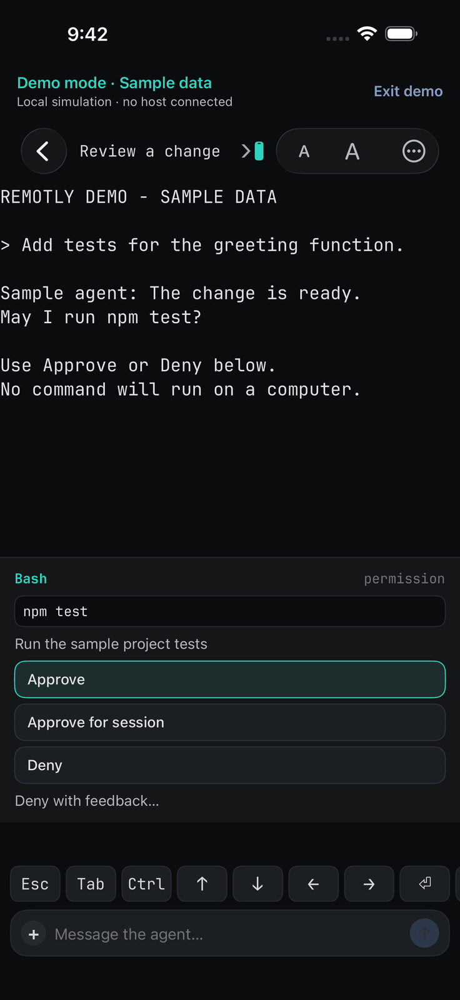
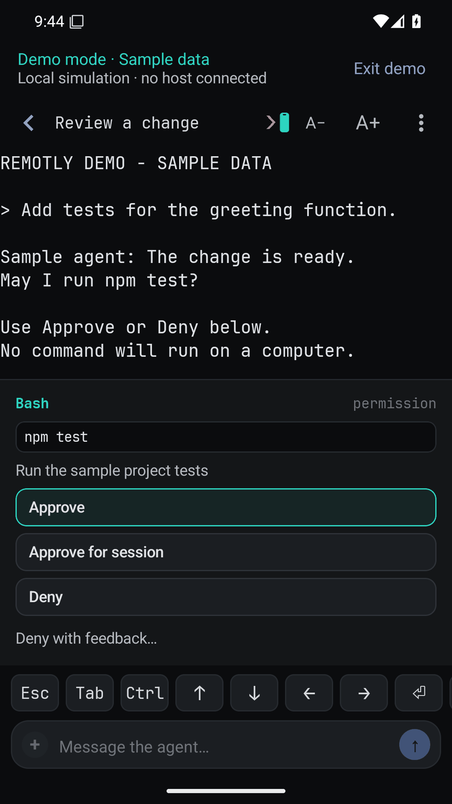
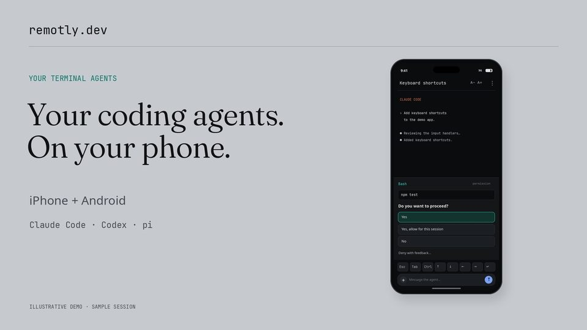

# Remotly

**Your terminal coding agents, on your phone.** Remotly is a native iPhone and Android app for the
[herdr](https://herdr.dev) sessions already running on your Linux machine: the live terminal of every pane, one-tap
approval of Claude Code, Codex and pi permission dialogs, and a notification when an agent is waiting for you or has
finished. The live terminal, pairing and input travel from the phone to your own machine over your
[Tailscale](https://tailscale.com) network; there is no Remotly account. Push notifications are delivered through a
hosted relay, and by default they carry the text shown in the notification (below). Product site:
[remotly.dev](https://remotly.dev).

<p>
  <a href="https://apps.apple.com/app/id6809486596"></a>
</p>

**[Set up your host](#get-started)**: one installer line, then scan a QR from the app. Every step is in
[ONBOARDING.md](ONBOARDING.md).

<p>
  
  &nbsp;&nbsp;
  
</p>

*Approving a sample request in **Try demo** on iPhone and Android. Screenshots of the apps showing labelled sample
data, not a live host.*

[](https://youtu.be/WIIIr_Yt44w)

*80-second walkthrough on [YouTube](https://youtu.be/WIIIr_Yt44w), and a
[44-second Short](https://youtube.com/shorts/picTY91ze-k) of the approve-and-reply flow. Both are illustrative
animations with synthetic sample sessions, not recordings of a phone.*

## What you need

- **A Linux host** running [herdr](https://herdr.dev) 0.8.x (protocol 19) and [Tailscale](https://tailscale.com), with
  MagicDNS and HTTPS certificates enabled for your tailnet. The bridge runs as a systemd user service; Linux hosts only.
- **A phone on the same tailnet:** iPhone or iPad (iOS 17 or newer) or an Android phone (Android 8.0 or newer), with the
  Tailscale app installed.
- **Agents:** the terminal, key row and composer work with any program in a herdr pane. Permission dialogs are
  recognised for Claude Code, Codex and pi.

Terminal traffic, pairing and input go directly from the phone to your host over the tailnet. Notifications are the
exception: the bridge posts each one to the hosted push relay (`relay.remotly.dev`), which holds the apps' Apple and
Google push credentials and forwards it to Apple or Google, so you never handle push credentials. By default a
notification may include, depending on its kind, the dialog or the last visible lines of the pane, the session title
and the one-line approval summary; `push.include_excerpt: false` keeps that text on the host (`bridge/README.md`,
"Configuration"). Approve, Deny and Reply from a notification still go from the phone to your host over Tailscale
(`relay/README.md`).

## Get started

1. On the host:
   ```sh
   curl -fsSL https://remotly.dev/install.sh | sh
   ```
   The installer puts the bridge under your home directory, checks herdr and Tailscale and prints the fix for anything
   missing, requests the certificate, installs the user service and prints one pairing QR.
2. Install Tailscale on the phone and log into the same tailnet, then open Remotly → **Pair** and scan the QR.
3. Allow notifications when the app asks.

Every step, LAN mode for a host without Tailscale (Android only) and daily use: [ONBOARDING.md](ONBOARDING.md). To look
around before setting up a host, tap **Try demo** on the pairing screen: sample sessions run on the phone itself, with
no host, no account and no network connection to a bridge ([docs/DEMO.md](docs/DEMO.md)). App links:
[App Store](https://apps.apple.com/app/id6809486596),
[Google Play](https://play.google.com/store/apps/details?id=com.inferenceaftermath.remotly); or build the apps yourself
with your own Apple and Google records (`ios/README.md`, `android/README.md`, `docs/DELIVERY.md`).

Pairing a phone gives it shell access on the host as your user; the tailnet and TLS are the perimeter. Read
[SECURITY.md](SECURITY.md) before pairing.

## Help and contributing

- Something broken or missing: [open an issue](https://github.com/inferenceaftermath/remotly/issues/new/choose).
  `remotly-bridge doctor` prints a fix for every failing check; the runbook is [docs/OPERATIONS.md](docs/OPERATIONS.md).
- A security problem: report it privately ([SECURITY.md](SECURITY.md)), never in a public issue.
- Changes are welcome: [CONTRIBUTING.md](CONTRIBUTING.md) has the ground rules and build commands,
  [docs/BACKLOG.md](docs/BACKLOG.md) the open work, [CHANGELOG.md](CHANGELOG.md) what shipped. Bridge releases are
  GitHub Releases tagged `bridge-vX.Y.Z`.

## How it works

- **The bridge** (`bridge/`; Node 24 runs the TypeScript directly, no build step) runs on the host beside herdr as a
  systemd user service. It reads herdr over its Unix socket, serves paired phones over TLS WebSockets on the Tailscale
  interface, and sends push notifications.
- **The apps** (`ios/`: SwiftUI and the `FlowKit` package; `android/`: Kotlin and Compose) pair with the bridge by
  scanning a QR, then show tabs and panes, a terminal grid, key row, composer and approval bar, plus a Live Activity /
  ongoing notification while an agent works.
- **The push relay** (`relay/`, a Cloudflare Worker) holds the apps' APNs key and Firebase service account, so a host
  never needs push credentials. A host that has its own credentials sends directly.
- **Shared** (`shared/`): the normative [wire protocol](shared/protocol/remotly-protocol.md), the
  [design system](shared/design/DESIGN.md) both apps follow, and golden test fixtures all three code bases check.

## Documentation

| | |
|---|---|
| [`ONBOARDING.md`](ONBOARDING.md) | set up a host, pair phones, daily use |
| [`bridge/README.md`](bridge/README.md) | the daemon: install, CLI, configuration, how it works |
| [`docs/OPERATIONS.md`](docs/OPERATIONS.md) | runbook: upgrades, TLS, pairing, push, troubleshooting |
| [`docs/DEMO.md`](docs/DEMO.md) | the apps' local demo mode |
| [`docs/DELIVERY.md`](docs/DELIVERY.md) | run your own TestFlight / Play delivery lane |
| [`docs/herdr-findings.md`](docs/herdr-findings.md) | measured herdr behaviour the bridge relies on |
| [`CONTRIBUTING.md`](CONTRIBUTING.md), [`docs/BACKLOG.md`](docs/BACKLOG.md), [`CHANGELOG.md`](CHANGELOG.md) | developing, open work, releases |

## Licence and third-party material

Apache License 2.0 ([LICENSE](LICENSE), [NOTICE](NOTICE)). The Android app bundles JetBrains Mono under the SIL Open Font
License 1.1 (`android/app/src/main/assets/JetBrainsMono-OFL.txt`) and receives push through Firebase Cloud Messaging,
which depends on the proprietary Google Play services. The fixtures under `shared/fixtures/` are redacted terminal screen
captures (Claude Code, Codex CLI, shell programs) used for interoperability tests. herdr is a separate product with its
own licence; Remotly only talks to its socket API. Under `docs/assets/readme/`, the App Store badge is Apple's official
artwork, used unaltered under Apple's badge guidelines and not covered by this repository's licence;
`demo-approval-*.png` and `social-preview.png` are screenshots of the apps' demo mode with sample data;
`demo-video-thumbnail.jpg` is the thumbnail of the illustrative animated walkthrough on YouTube, not an app screenshot.

Remotly.dev is developed and maintained by [Inference Aftermath](https://inferenceaftermath.com). We are building
<a href="https://entwyn.ai/">Entwyn </a>.
